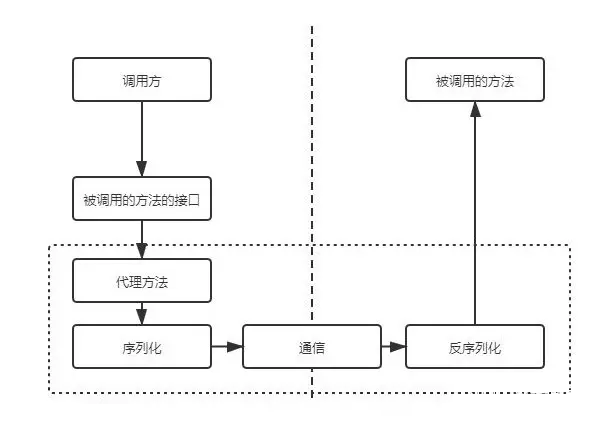

# RPC

RPC, Remote Procedure Call（远程过程调用）.

它允许程序调用另一个地址空间（通常是共享网络的另一台机器上）的过程或函数，而不用程序员显式编码这个远程调用的细节。 即无论是调用本地接口/服务的还是远程的接口/服务，本质上编写的调用代码基本相同。

比如两台服务器A、B，一个应用部署在A服务器上，想要调用B服务器上应用提供的函数或者方法，由于不在一个内存空间，不能直接调用，这时候需要通过RPC框架的实现来解决。

RPC的实现：

- Spring Cloud OpenFeign
- Spring 6.0/Spring Boot 3.0 新特性：HTTP Interface
